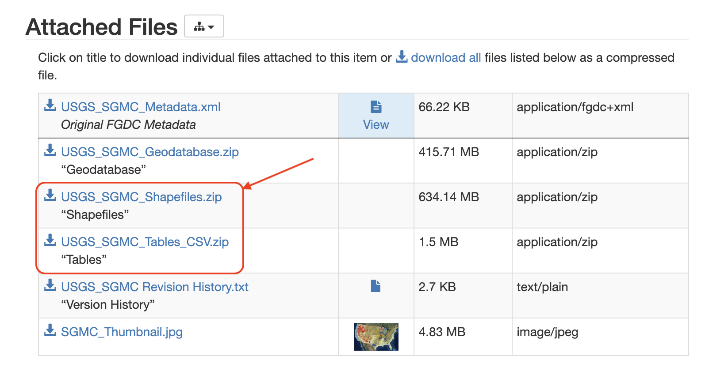

# Evidence Layer Synthesis for Critical Mineral Prospectivity

## Download SGMC data
SGMC data can be accessed through [this link](https://www.sciencebase.gov/catalog/item/5888bf4fe4b05ccb964bab9d). The attached files specifically needed for this tool are:
1. USGS_SGMC_Shapefiles.zip
2. USGS_SGMC_Tables_CSV.zip



Download these two zipped files and extract them to your local machine.

## Mac user
### Environment setup
1. Install Anaconda
2. Install Homebrew
3. Install the enchant C-library: `brew update; brew install enchant`
4. Make brew libraries, e.g. enchant, discoverable by conda python: https://github.com/pyenchant/pyenchant/issues/265#issuecomment-998965819
5. Pick a work directory
   - `git clone https://github.com/DARPA-CRITICALMAAS/sri-ta2-mappable-criteria.git`
   - `cd sri-ta2-mappable-criteria/polygon_ranking`
   - `conda create -n sri-map-synth python=3.10`
   - `conda activate sri-map-synth`
   - `pip install -r requirements.txt`

### generate maps
1. preprocessing

2. ranking (map synthesis)


## Linux user
### Build docker image
```bash
git clone https://github.com/DARPA-CRITICALMAAS/sri-ta2-mappable-criteria.git
cd sri-ta2-mappable-criteria/polygon_ranking
docker build . -t sri-map-synth -f Dockerfile
```

### Docker run
There are two steps needed for generating synthesized evidence map layers:
- Step 1: preprocess the SGMC data and save the output to `/path/to/output_preproc`
```bash
docker run --rm -it \
    --gpus all \
    -v /path/to/USGS_SGMC_Shapefiles/SGMC_Geology.dbf:/workdir/SGMC_Geology.dbf \
    -v /path/to/USGS_SGMC_Tables_CSV/SGMC_Units.csv:/workdir/SGMC_Units.csv \
    -v /path/to/output_preproc:/workdir/output_preproc \
    --entrypoint sh \
    sri-map-synth \
    -c 'python polygon_ranking.py preproc --input_shapefile SGMC_Geology.dbf --input_desc SGMC_Units.csv --output output_preproc/SGMC_preproc.parquet'
```

- Step 2: compute text embedding scores of each polygon w.r.t. a particular deposit type (e.g., `porphyry_copper`):
```bash
docker run --rm -it \
    --gpus all \
    -v /path/to/output_preproc:/workdir/output_preproc \
    -v /path/to/output_rank:/workdir/output_rank \
    --entrypoint sh \
    sri-map-synth \
    -c 'python polygon_ranking.py rank --processed_input output_preproc/SGMC_preproc.parquet --deposit_type porphyry_copper --normalize --output_dir output_rank'
```
*Note: the `--normalize` flag is used for mapping text embedding-based scores linearly to the range of [0,1]. It is suggested to NOT use this flag if the input polygons all have the same textual description.*